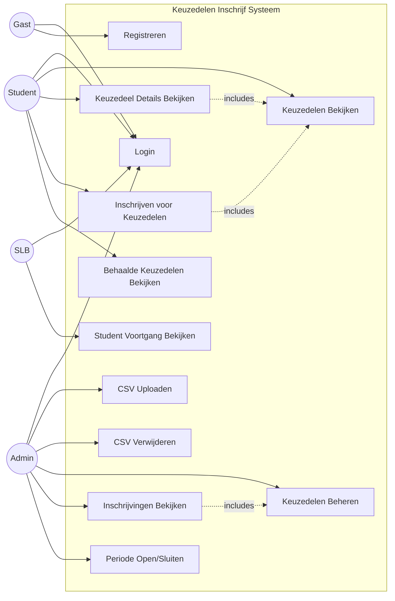
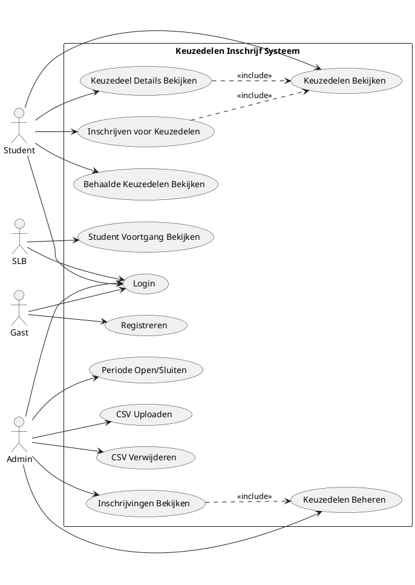

# Use Case Diagram - Keuzedelen Inschrijf Applicatie

**Project:** Keuzedelen Inschrijf Systeem  
**Datum:** 1 februari 2026  
**Niveau:** MBO4

---

## Wat is een Use Case Diagram?

Een Use Case Diagram laat zien:
- **Wie** gebruikt het systeem (actoren = gebruikers)
- **Wat** ze kunnen doen (use cases = functies)
- **Hoe** de functies met elkaar samenhangen

Het is als een overzicht van "wie kan wat doen" in de applicatie.

---

## Actoren (Gebruikers)

| Actor | Beschrijving | Rol in systeem |
|-------|-------------|----------------|
| **Student** | Leerling die keuzedelen wil volgen | Kan keuzedelen bekijken en inschrijven |
| **Admin** | Beheerder van het systeem | Beheert keuzedelen, CSV uploads en inschrijvingen |
| **SLB** | Studieloopbaanbegeleider | Begeleidt studenten (toekomstig) |
| **Gast** | Bezoeker zonder account | Kan alleen inloggen of registreren |

---

## Use Case Diagram (Mermaid Syntax)



---

## Alternative: PlantUML Syntax



---

## Visuele Weergave (ASCII)

```
                    KEUZEDELEN INSCHRIJF SYSTEEM
    ┌──────────────────────────────────────────────────────────┐
    │                                                          │
    │  ┌────────────┐      ┌────────────┐                     │
    │  │   Login    │      │ Registreren│                     │
    │  └────────────┘      └────────────┘                     │
    │         ▲                   ▲                            │
    │         │                   │                            │
    │    ┌────┴─────┬─────────────┼──────────────┐            │
    │    │          │             │              │            │
    │                                                          │
 ┌────┐  ┌────────────────────────────────────┐  ┌──────┐    │
 │Gast│  │        Student Functies            │  │Admin │    │
 └────┘  │                                    │  └──────┘    │
    │    │  ┌─────────────────────────┐      │      │        │
    │    │  │ Keuzedelen Bekijken     │◄─────┼──────┘        │
    │    │  └─────────────────────────┘      │               │
    │    │           ▲        ▲               │               │
    │    │           │        │               │  ┌─────────────────┐
    │    │  ┌────────┴───┐ ┌─┴──────────┐    │  │ CSV Uploaden    │
    │    │  │ Details    │ │ Inschrijven│    │  └─────────────────┘
    │    │  │ Bekijken   │ │            │    │           ▲
    │    │  └────────────┘ └────────────┘    │           │
    │    │                                    │  ┌─────────────────┐
    │    │  ┌─────────────────────────┐      │  │ CSV Verwijderen │
    │    │  │ Behaalde Keuzedelen     │      │  └─────────────────┘
    │    │  │ Bekijken                │      │           ▲
    │    │  └─────────────────────────┘      │           │
    │    └────────────────────────────────────┘  ┌─────────────────┐
    │                                            │ Keuzedelen      │
 ┌────┐                                          │ Beheren         │
 │SLB │  ┌─────────────────────────┐            └─────────────────┘
 └────┘  │ Student Voortgang       │                     ▲
    └───►│ Bekijken                │                     │
         └─────────────────────────┘            ┌─────────────────┐
                                                │ Inschrijvingen  │
                                                │ Bekijken        │
                                                └─────────────────┘
                                                         ▲
                                                         │
                                                ┌─────────────────┐
                                                │ Periode         │
                                                │ Open/Sluiten    │
                                                └─────────────────┘
```

---

## Use Cases Uitgewerkt

### 1. Login (UC1)
- **Actor:** Gast, Student, Admin, SLB
- **Beschrijving:** Gebruiker logt in met email en wachtwoord
- **Precondities:** Gebruiker heeft een account
- **Postcondities:** Gebruiker is ingelogd en ziet zijn/haar dashboard
- **Normaal verloop:**
  1. Gebruiker opent de login pagina
  2. Gebruiker voert email in
  3. Gebruiker voert wachtwoord in
  4. Systeem controleert gegevens
  5. Systeem toont dashboard op basis van rol
- **Alternatief verloop:**
  - 4a. Gegevens incorrect → foutmelding + probeer opnieuw

### 2. Registreren (UC2)
- **Actor:** Gast
- **Beschrijving:** Nieuwe gebruiker maakt een account aan
- **Precondities:** Geen
- **Postcondities:** Nieuw account is aangemaakt
- **Normaal verloop:**
  1. Gebruiker klikt op "Registreren"
  2. Gebruiker voert naam, email, wachtwoord in
  3. Systeem valideert gegevens
  4. Systeem maakt account aan
  5. Gebruiker kan inloggen
- **Alternatief verloop:**
  - 3a. Email bestaat al → foutmelding
  - 3b. Wachtwoord te zwak → foutmelding

### 3. Keuzedelen Bekijken (UC3)
- **Actor:** Student
- **Beschrijving:** Student bekijkt beschikbare keuzedelen voor zijn/haar opleiding
- **Precondities:** Student is ingelogd
- **Postcondities:** Student ziet lijst van keuzedelen
- **Normaal verloop:**
  1. Student opent homepage
  2. Systeem haalt student's opleiding op
  3. Systeem filtert keuzedelen op opleiding
  4. Systeem toont lijst met capaciteit en status

### 4. Keuzedeel Details Bekijken (UC4)
- **Actor:** Student
- **Beschrijving:** Student bekijkt uitgebreide informatie over een keuzedeel
- **Precondities:** Student is ingelogd
- **Postcondities:** Student ziet alle details
- **Normaal verloop:**
  1. Student klikt op "Meer Info" bij een keuzedeel
  2. Systeem toont detail pagina met:
     - Beschrijving
     - Capaciteit
     - Periode
     - Status
- **Includes:** UC3 (Keuzedelen Bekijken)

### 5. Inschrijven voor Keuzedelen (UC5)
- **Actor:** Student
- **Beschrijving:** Student schrijft zich in voor 3 keuzedelen (1e, 2e, 3e keuze)
- **Precondities:** 
  - Student is ingelogd
  - Inschrijfperiode is open
- **Postcondities:** Inschrijving is opgeslagen
- **Normaal verloop:**
  1. Student klikt op "Inschrijven"
  2. Systeem toont formulier met 3 dropdowns
  3. Student selecteert 3 verschillende keuzedelen
  4. Student klikt "Bevestigen"
  5. Systeem controleert:
     - Alle 3 zijn verschillend
     - Keuzedelen zijn actief
     - Keuzedelen zijn niet vol
     - Student heeft ze niet al behaald
     - Periode is open
  6. Systeem slaat inschrijving op
  7. Systeem toont bevestiging
- **Alternatief verloop:**
  - 3a. Keuzedelen zijn hetzelfde → foutmelding
  - 5a. Keuzedeel is vol → foutmelding
  - 5b. Student heeft keuzedeel al behaald → foutmelding
  - 5c. Periode is gesloten → foutmelding
- **Includes:** UC3 (Keuzedelen Bekijken)

### 6. Behaalde Keuzedelen Bekijken (UC6)
- **Actor:** Student
- **Beschrijving:** Student ziet welke keuzedelen hij/zij al behaald heeft
- **Precondities:** Student is ingelogd
- **Postcondities:** Student ziet lijst van behaalde keuzedelen
- **Normaal verloop:**
  1. Student klikt op "Mijn Behaalde Keuzedelen"
  2. Systeem haalt behaalde keuzedelen op uit database
  3. Systeem toont lijst met naam, code en periode

### 7. CSV Uploaden (UC7)
- **Actor:** Admin
- **Beschrijving:** Admin uploadt CSV met studenten en behaalde keuzedelen
- **Precondities:** Admin is ingelogd
- **Postcondities:** 
  - Gebruikers zijn aangemaakt
  - Behaalde keuzedelen zijn gekoppeld
- **Normaal verloop:**
  1. Admin opent CSV upload pagina
  2. Admin selecteert CSV bestand
  3. Admin klikt "Upload"
  4. Systeem leest CSV
  5. Systeem detecteert delimiter (; of ,)
  6. Systeem controleert kolommen
  7. Systeem maakt users aan
  8. Systeem koppelt behaalde keuzedelen
  9. Systeem slaat bestand op in storage/app/csv
  10. Systeem toont succesmelding
- **Alternatief verloop:**
  - 6a. CSV formaat incorrect → foutmelding
  - 6b. Keuzedeel bestaat niet → warning, skip die rij

### 8. CSV Verwijderen (UC8)
- **Actor:** Admin
- **Beschrijving:** Admin verwijdert een geüpload CSV bestand en bijbehorende users
- **Precondities:** 
  - Admin is ingelogd
  - CSV bestand bestaat
- **Postcondities:** 
  - Bestand is verwijderd
  - Users uit dat bestand zijn verwijderd
- **Normaal verloop:**
  1. Admin ziet lijst van geüploade bestanden
  2. Admin klikt "Verwijderen" bij een bestand
  3. Systeem vraagt bevestiging
  4. Admin bevestigt
  5. Systeem zoekt users met deze csv_source
  6. Systeem verwijdert users en gerelateerde data
  7. Systeem verwijdert CSV bestand
  8. Systeem toont succesmelding

### 9. Keuzedelen Beheren (UC9)
- **Actor:** Admin
- **Beschrijving:** Admin beheert keuzedelen (CRUD operaties)
- **Precondities:** Admin is ingelogd
- **Postcondities:** Keuzedeel is toegevoegd/bewerkt/verwijderd
- **Normaal verloop:**
  1. Admin opent keuzedelen beheer pagina
  2. Admin kan kiezen:
     - Nieuw keuzedeel toevoegen
     - Bestaand keuzedeel bewerken
     - Keuzedeel deactiveren/activeren
  3. Admin vult formulier in
  4. Systeem valideert data
  5. Systeem slaat wijzigingen op
- **Status:** TODO - Nog niet geïmplementeerd

### 10. Inschrijvingen Bekijken (UC10)
- **Actor:** Admin
- **Beschrijving:** Admin bekijkt wie ingeschreven is per keuzedeel
- **Precondities:** Admin is ingelogd
- **Postcondities:** Admin ziet overzicht van inschrijvingen
- **Normaal verloop:**
  1. Admin opent inschrijvingen overzicht
  2. Admin selecteert een keuzedeel
  3. Systeem toont lijst van ingeschreven studenten met:
     - Studentnummer
     - Naam
     - Klas
     - Prioriteit (1e/2e/3e keuze)
  4. Admin kan lijst exporteren naar Excel
- **Includes:** UC9 (Keuzedelen Beheren)
- **Status:** TODO - Nog niet geïmplementeerd

### 11. Periode Open/Sluiten (UC11)
- **Actor:** Admin
- **Beschrijving:** Admin opent of sluit de inschrijfperiode
- **Precondities:** Admin is ingelogd
- **Postcondities:** Inschrijfperiode status is gewijzigd
- **Normaal verloop:**
  1. Admin opent periode beheer
  2. Admin ziet huidige status (open/gesloten)
  3. Admin klikt toggle knop
  4. Systeem wijzigt status
  5. Studenten kunnen wel/niet meer inschrijven
- **Status:** TODO - Nog niet geïmplementeerd

### 12. Student Voortgang Bekijken (UC12)
- **Actor:** SLB
- **Beschrijving:** SLB bekijkt voortgang van studenten
- **Precondities:** SLB is ingelogd
- **Postcondities:** SLB ziet student informatie
- **Normaal verloop:**
  1. SLB opent student overzicht
  2. SLB selecteert een student
  3. Systeem toont:
     - Behaalde keuzedelen
     - Huidige inschrijvingen
     - Voortgang
- **Status:** TODO - Toekomstige functionaliteit

---

## Relaties tussen Use Cases

### Include (<<include>>)
Betekenis: Use case A **moet altijd** gebruik maken van use case B

**Voorbeelden:**
- "Inschrijven" includes "Keuzedelen Bekijken" → Je moet keuzedelen kunnen zien om te kunnen inschrijven
- "Keuzedeel Details" includes "Keuzedelen Bekijken" → Details zijn onderdeel van het bekijken
- "Inschrijvingen Bekijken" includes "Keuzedelen Beheren" → Admin moet keuzedelen kennen om inschrijvingen te zien

### Extend (<<extend>>)
Betekenis: Use case A **kan optioneel** uitgebreid worden met use case B

**Voorbeeld (toekomstig):**
- "Inschrijven" extends "Email Notificatie Versturen" → Optioneel kan er een email verstuurd worden

---

## Implementatie Status

| Use Case | Status | Opmerkingen |
|----------|--------|-------------|
| UC1: Login | ✅ Compleet | Laravel Auth |
| UC2: Registreren | ✅ Compleet | Laravel Auth |
| UC3: Keuzedelen Bekijken | ✅ Compleet | HomeController |
| UC4: Details Bekijken | ✅ Compleet | KeuzedeelController |
| UC5: Inschrijven | 🟡 Basis | Validatie checks ontbreken |
| UC6: Behaalde Keuzedelen | ✅ Compleet | BehaaldeKeuzedelenController |
| UC7: CSV Uploaden | ✅ Compleet | AdminCsvImportController |
| UC8: CSV Verwijderen | ✅ Compleet | AdminCsvImportController |
| UC9: Keuzedelen Beheren | ❌ TODO | Moet nog gebouwd worden |
| UC10: Inschrijvingen Bekijken | ❌ TODO | Moet nog gebouwd worden |
| UC11: Periode Open/Sluiten | ❌ TODO | Moet nog gebouwd worden |
| UC12: Student Voortgang | ❌ TODO | Toekomstige functionaliteit |

---

## Tips voor MBO4 Studenten

### Hoe lees je een Use Case Diagram?

1. **Start bij de actoren** (ronde figuren links/rechts)
   - Dit zijn de mensen die het systeem gebruiken

2. **Kijk naar de lijnen**
   - Rechte lijn = Actor kan deze functie gebruiken
   - Gestippelde lijn = Functies hangen samen

3. **Lees de use cases** (ovalen in het midden)
   - Dit zijn acties die je kunt doen

4. **Volg een flow**
   - Bijvoorbeeld: Student → Login → Keuzedelen Bekijken → Inschrijven

### Waarom is dit belangrijk?

- Overzicht van alle functies
- Wie mag wat doen
- Helpt bij plannen van het bouwen
- Duidelijk voor opdrachtgever wat het systeem doet

