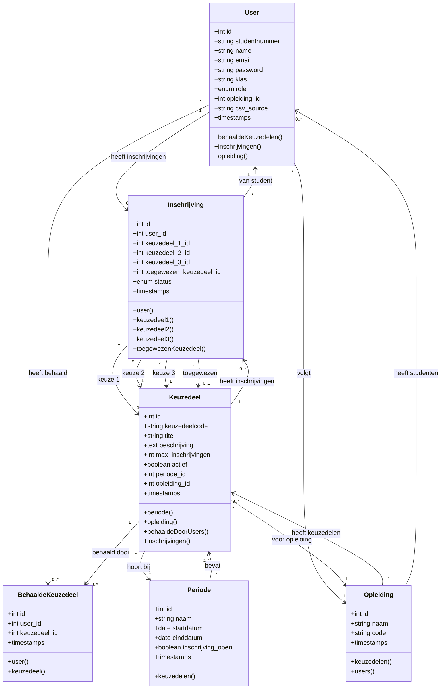
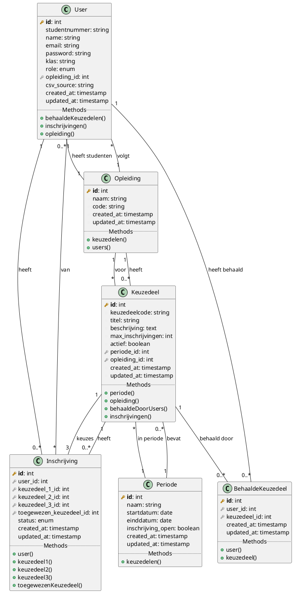

# Klassendiagram - Keuzedelen Inschrijf Applicatie

**Project:** Keuzedelen Inschrijf Systeem  
**Datum:** 1 februari 2026  
**Niveau:** MBO4

---

## Wat is een Klassendiagram?

Een klassendiagram laat zien:
- **Welke tabellen** er in de database zitten (klassen)
- **Welke gegevens** er worden opgeslagen (attributen/velden)
- **Hoe de tabellen met elkaar verbonden** zijn (relaties)

Het is als een bouwtekening van je database.

---

## Database Overzicht

| Tabel | Functie |
|-------|---------|
| **users** | Gebruikers (studenten, admins, SLB'ers) |
| **keuzedelen** | Beschikbare keuzedelen |
| **periodes** | Inschrijfperiodes (Q1, Q2, etc.) |
| **opleidingen** | Opleidingen (SD, ICT, etc.) |
| **behaalde_keuzedelen** | Welke student heeft welk keuzedeel behaald |
| **inschrijvingen** | Inschrijvingen van studenten (3 keuzes) |

---

## Klassendiagram (Mermaid Syntax)



---

## Alternative: PlantUML Syntax



---

## Visuele Weergave (ASCII)

```
┌─────────────────────┐         ┌──────────────────────┐
│      User           │         │    Opleiding         │
├─────────────────────┤         ├──────────────────────┤
│ 🔑 id               │         │ 🔑 id                │
│    studentnummer    │    ┌───►│    naam              │
│    name             │    │    │    code              │
│    email            │    │    └──────────────────────┘
│    password         │    │              │
│    klas             │    │              │ heeft
│    role             │    │              │ keuzedelen
│ 🔗 opleiding_id ────┴────┘              ▼
│    csv_source       │         ┌──────────────────────┐
└─────────────────────┘         │    Keuzedeel         │
         │                      ├──────────────────────┤
         │ heeft                │ 🔑 id                │
         │ behaald              │    keuzedeelcode     │
         │                      │    titel             │
         ▼                      │    beschrijving      │
┌─────────────────────┐         │    max_inschrijvingen│
│ BehaaldeKeuzedeel   │◄────────│    actief            │
├─────────────────────┤  behaald│ 🔗 periode_id        │
│ 🔑 id               │    door │ 🔗 opleiding_id      │
│ 🔗 user_id          │         └──────────────────────┘
│ 🔗 keuzedeel_id     │                   │
└─────────────────────┘                   │ in
         ▲                                │ periode
         │                                ▼
         │                      ┌──────────────────────┐
┌─────────────────────┐         │     Periode          │
│      User           │         ├──────────────────────┤
├─────────────────────┤         │ 🔑 id                │
│ 🔑 id               │         │    naam              │
│    ...              │         │    startdatum        │
└─────────────────────┘         │    einddatum         │
         │                      │    inschrijving_open │
         │ heeft                └──────────────────────┘
         │ inschrijvingen
         ▼
┌─────────────────────────────┐
│     Inschrijving            │
├─────────────────────────────┤
│ 🔑 id                       │
│ 🔗 user_id                  │
│ 🔗 keuzedeel_1_id (1e keuze)│
│ 🔗 keuzedeel_2_id (2e keuze)│
│ 🔗 keuzedeel_3_id (3e keuze)│
│ 🔗 toegewezen_keuzedeel_id  │
│    status                   │
└─────────────────────────────┘
```

**Legenda:**
- 🔑 = Primary Key (unieke identificatie)
- 🔗 = Foreign Key (verwijst naar andere tabel)
- ▶ = Relatie pijl

---

## Tabel Details

### 1. User (Gebruikers)

| Veld | Type | Beschrijving | Verplicht |
|------|------|--------------|-----------|
| **id** | INTEGER | Unieke gebruiker ID | Ja (PK) |
| studentnummer | VARCHAR(50) | Studentnummer (bijv. 2024001) | Ja |
| name | VARCHAR(255) | Volledige naam | Ja |
| email | VARCHAR(255) | Email adres (uniek) | Ja |
| password | VARCHAR(255) | Gehashed wachtwoord | Ja |
| klas | VARCHAR(10) | Klas (bijv. SD4A) | Nee |
| role | ENUM | 'student', 'admin', 'slb' | Ja |
| opleiding_id | INTEGER | Link naar Opleiding tabel | Nee (FK) |
| csv_source | VARCHAR(255) | Naam van CSV bestand | Nee |
| created_at | TIMESTAMP | Aanmaak datum | Auto |
| updated_at | TIMESTAMP | Laatste wijziging | Auto |

**Relaties:**
- **1 User → veel BehaaldeKeuzedelen** (Een student kan meerdere keuzedelen behaald hebben)
- **1 User → veel Inschrijvingen** (Een student kan meerdere keren inschrijven)
- **Veel Users → 1 Opleiding** (Meerdere studenten volgen dezelfde opleiding)

### 2. Keuzedeel

| Veld | Type | Beschrijving | Verplicht |
|------|------|--------------|-----------|
| **id** | INTEGER | Unieke keuzedeel ID | Ja (PK) |
| keuzedeelcode | VARCHAR(50) | Code (bijv. SD-001) | Ja (uniek) |
| titel | VARCHAR(255) | Naam van keuzedeel | Ja |
| beschrijving | TEXT | Uitleg over keuzedeel | Nee |
| max_inschrijvingen | INTEGER | Maximum aantal plaatsen | Ja |
| actief | BOOLEAN | Is keuzedeel beschikbaar? | Ja |
| periode_id | INTEGER | Link naar Periode tabel | Ja (FK) |
| opleiding_id | INTEGER | Link naar Opleiding tabel | Ja (FK) |
| created_at | TIMESTAMP | Aanmaak datum | Auto |
| updated_at | TIMESTAMP | Laatste wijziging | Auto |

**Relaties:**
- **1 Keuzedeel → veel BehaaldeKeuzedelen** (Meerdere studenten kunnen hetzelfde keuzedeel behalen)
- **Veel Keuzedelen → 1 Periode** (Keuzedelen horen bij een periode)
- **Veel Keuzedelen → 1 Opleiding** (Keuzedelen zijn voor een opleiding)
- **1 Keuzedeel → veel Inschrijvingen** (Studenten schrijven zich in voor keuzedelen)

### 3. Periode (Inschrijfperiode)

| Veld | Type | Beschrijving | Verplicht |
|------|------|--------------|-----------|
| **id** | INTEGER | Unieke periode ID | Ja (PK) |
| naam | VARCHAR(100) | Naam (bijv. "Periode 3, 2026") | Ja |
| startdatum | DATE | Start van periode | Ja |
| einddatum | DATE | Einde van periode | Ja |
| inschrijving_open | BOOLEAN | Is inschrijving open? | Ja |
| created_at | TIMESTAMP | Aanmaak datum | Auto |
| updated_at | TIMESTAMP | Laatste wijziging | Auto |

**Relaties:**
- **1 Periode → veel Keuzedelen** (Een periode heeft meerdere keuzedelen)

### 4. Opleiding

| Veld | Type | Beschrijving | Verplicht |
|------|------|--------------|-----------|
| **id** | INTEGER | Unieke opleiding ID | Ja (PK) |
| naam | VARCHAR(255) | Naam (bijv. "Software Developer") | Ja |
| code | VARCHAR(10) | Afkorting (bijv. "SD") | Ja (uniek) |
| created_at | TIMESTAMP | Aanmaak datum | Auto |
| updated_at | TIMESTAMP | Laatste wijziging | Auto |

**Relaties:**
- **1 Opleiding → veel Keuzedelen** (Een opleiding heeft meerdere keuzedelen)
- **1 Opleiding → veel Users** (Meerdere studenten volgen de opleiding)

### 5. BehaaldeKeuzedeel (Koppeltabel)

| Veld | Type | Beschrijving | Verplicht |
|------|------|--------------|-----------|
| **id** | INTEGER | Unieke ID | Ja (PK) |
| user_id | INTEGER | Link naar User (student) | Ja (FK) |
| keuzedeel_id | INTEGER | Link naar Keuzedeel | Ja (FK) |
| created_at | TIMESTAMP | Wanneer behaald | Auto |
| updated_at | TIMESTAMP | Laatste wijziging | Auto |

**Relaties:**
- **Veel BehaaldeKeuzedelen → 1 User** (Behaalde keuzedelen van één student)
- **Veel BehaaldeKeuzedelen → 1 Keuzedeel** (Wie heeft dit keuzedeel behaald)

**Functie:** Deze tabel verbindt studenten met hun behaalde keuzedelen (Many-to-Many relatie)

### 6. Inschrijving

| Veld | Type | Beschrijving | Verplicht |
|------|------|--------------|-----------|
| **id** | INTEGER | Unieke inschrijving ID | Ja (PK) |
| user_id | INTEGER | Link naar User (student) | Ja (FK) |
| keuzedeel_1_id | INTEGER | 1e keuze keuzedeel | Ja (FK) |
| keuzedeel_2_id | INTEGER | 2e keuze keuzedeel | Ja (FK) |
| keuzedeel_3_id | INTEGER | 3e keuze keuzedeel | Ja (FK) |
| toegewezen_keuzedeel_id | INTEGER | Welke is toegewezen (admin bepaalt) | Nee (FK) |
| status | ENUM | 'pending', 'approved', 'rejected' | Ja |
| created_at | TIMESTAMP | Wanneer ingeschreven | Auto |
| updated_at | TIMESTAMP | Laatste wijziging | Auto |

**Relaties:**
- **Veel Inschrijvingen → 1 User** (Inschrijvingen van één student)
- **Veel Inschrijvingen → 1 Keuzedeel** (per keuze - 3x)

**Functie:** Een student kan 3 keuzedelen kiezen in volgorde van voorkeur. Admin wijst uiteindelijk één keuzedeel toe.

---

## Relatie Types Uitgelegd (MBO4)

### One-to-Many (1 → veel) ⭐ Meest voorkomend

**Voorbeeld:** 1 Opleiding heeft veel Studenten
- Elke student hoort bij **één** opleiding
- Elke opleiding heeft **meerdere** studenten

**In database:**
```
Opleiding tabel         User tabel
┌────┬──────┐          ┌────┬──────┬──────────────┐
│ id │ naam │          │ id │ name │ opleiding_id │
├────┼──────┤          ├────┼──────┼──────────────┤
│ 1  │ SD   │◄────┬───│ 1  │ Jan  │      1       │
│ 2  │ ICT  │     ├───│ 2  │ Piet │      1       │
└────┴──────┘     │   │ 3  │ Lisa │      2       │
                  └───│ 4  │ Tim  │      1       │
                      └────┴──────┴──────────────┘
```

**In Laravel Model:**
```php
// Opleiding.php
public function users() {
    return $this->hasMany(User::class);
}

// User.php
public function opleiding() {
    return $this->belongsTo(Opleiding::class);
}
```

### Many-to-Many (veel ↔ veel)

**Voorbeeld:** Studenten ↔ Behaalde Keuzedelen
- Een student kan meerdere keuzedelen behalen
- Een keuzedeel kan door meerdere studenten behaald worden

**In database:** Gebruik een **koppeltabel** (BehaaldeKeuzedeel)
```
User                  BehaaldeKeuzedeel           Keuzedeel
┌────┬──────┐        ┌────┬─────────┬────────────┐  ┌────┬──────┐
│ id │ naam │        │ id │ user_id │keuzedeel_id│  │ id │titel │
├────┼──────┤        ├────┼─────────┼────────────┤  ├────┼──────┤
│ 1  │ Jan  │◄───────│ 1  │    1    │     10     │─►│ 10 │ Web  │
│ 2  │ Piet │◄───┬───│ 2  │    1    │     11     │──►│ 11 │ CSS  │
└────┴──────┘    │   │ 3  │    2    │     10     │──┘└────┴──────┘
                 └───│ 4  │    2    │     12     │───►12 │ JS   │
                     └────┴─────────┴────────────┘   └────┴──────┘
```
Jan heeft behaald: Web + CSS  
Piet heeft behaald: Web + JS

**In Laravel Model:**
```php
// User.php
public function behaaldeKeuzedelen() {
    return $this->hasMany(BehaaldeKeuzedeel::class);
}

// Keuzedeel.php
public function behaaldeDoorUsers() {
    return $this->hasMany(BehaaldeKeuzedeel::class);
}
```

---

## Belangrijke Concepten

### Primary Key (PK) 🔑
- **Wat:** Unieke identificatie van een rij in de tabel
- **Voorbeeld:** `id` veld
- **Waarom:** Zorgt dat elke rij uniek is

### Foreign Key (FK) 🔗
- **Wat:** Verwijst naar de Primary Key van een andere tabel
- **Voorbeeld:** `opleiding_id` in User tabel verwijst naar `id` in Opleiding tabel
- **Waarom:** Maakt relaties mogelijk tussen tabellen

### Timestamps
- **created_at:** Wanneer is de rij aangemaakt
- **updated_at:** Wanneer is de rij voor het laatst gewijzigd
- Laravel doet dit automatisch

### Enum Type
- **Wat:** Veld kan alleen specifieke waarden hebben
- **Voorbeeld:** `role` kan alleen 'student', 'admin' of 'slb' zijn
- **Waarom:** Voorkomt foute data

---

## Database Normalisatie (MBO4 Uitleg)

### Waarom aparte tabellen?

❌ **Slecht:** Alles in één tabel
```
┌────┬──────┬─────────────┬──────────────┬─────────────┐
│ id │ naam │ opleiding   │ behaald_1    │ behaald_2   │
├────┼──────┼─────────────┼──────────────┼─────────────┤
│ 1  │ Jan  │ SD, Niveau4 │ Web Dev      │ CSS         │
│ 2  │ Piet │ SD, Niveau4 │ Web Dev      │ JavaScript  │
└────┴──────┴─────────────┴──────────────┴─────────────┘
```
**Problemen:**
- Opleiding info herhaalt zich
- Als opleiding naam verandert, moet je overal aanpassen
- Wat als student 10 keuzedelen behaalt? 10 kolommen?

✅ **Goed:** Gescheiden tabellen met relaties
```
User                    Opleiding              BehaaldeKeuzedeel
┌────┬──────┬────┐     ┌────┬──────┐          ┌────┬────┬────┐
│ id │ naam │opl │───►│ id │ naam │          │ id │usr │kdl │
└────┴──────┴────┘     └────┴──────┘          └────┴────┴────┘
```
**Voordelen:**
- Geen dubbele data
- Makkelijk aan te passen
- Onbeperkt aantal behaalde keuzedelen

---

## Implementatie in Laravel

### Model Relaties

**User.php:**
```php
public function behaaldeKeuzedelen() {
    return $this->hasMany(BehaaldeKeuzedeel::class);
}

public function opleiding() {
    return $this->belongsTo(Opleiding::class);
}

public function inschrijvingen() {
    return $this->hasMany(Inschrijving::class);
}
```

**Keuzedeel.php:**
```php
public function periode() {
    return $this->belongsTo(Periode::class);
}

public function opleiding() {
    return $this->belongsTo(Opleiding::class);
}

public function behaaldeDoorUsers() {
    return $this->hasMany(BehaaldeKeuzedeel::class);
}
```

---

## Voorbeeld Queries

### Alle behaalde keuzedelen van een student
```php
$student = User::find(1);
$behaald = $student->behaaldeKeuzedelen;
```

### Alle keuzedelen voor opleiding SD
```php
$opleiding = Opleiding::where('code', 'SD')->first();
$keuzedelen = $opleiding->keuzedelen;
```

### Hoeveel inschrijvingen heeft een keuzedeel?
```php
$keuzedeel = Keuzedeel::find(10);
$count = Inschrijving::where('keuzedeel_1_id', $keuzedeel->id)
    ->orWhere('keuzedeel_2_id', $keuzedeel->id)
    ->orWhere('keuzedeel_3_id', $keuzedeel->id)
    ->count();
```

---

## Validatie Regels

### User
- Email moet uniek zijn
- Studentnummer moet uniek zijn
- Role moet 'student', 'admin' of 'slb' zijn
- Password minimaal 8 karakters

### Keuzedeel
- Keuzedeelcode moet uniek zijn
- Max_inschrijvingen moet > 0 zijn
- Actief moet true of false zijn

### Inschrijving
- Alle 3 keuzedelen moeten verschillend zijn
- Student mag keuzedeel niet al behaald hebben
- Keuzedeel moet actief zijn
- Periode moet open zijn
- Keuzedeel mag niet vol zijn

---

## Tips voor MBO4

### Hoe lees je een klassendiagram?

1. **Begin met de tabelnamen** (grote blokken)
2. **Bekijk de velden** (wat wordt er opgeslagen?)
3. **Volg de pijlen** (hoe hangen tabellen samen?)
4. **Let op 🔑 (primary key) en 🔗 (foreign key)**

### Waarom is dit belangrijk?

- Duidelijk overzicht van je database structuur
- Helpt bij het schrijven van queries
- Voorkomt fouten in je code
- Makkelijker samenwerken met anderen

