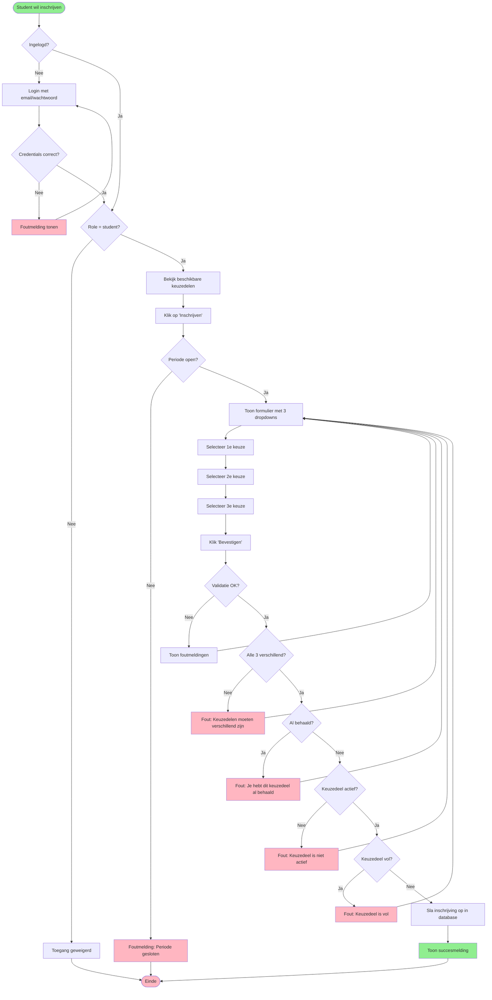
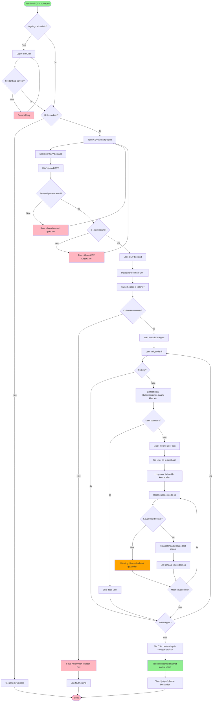
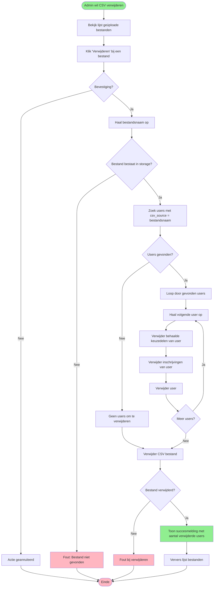
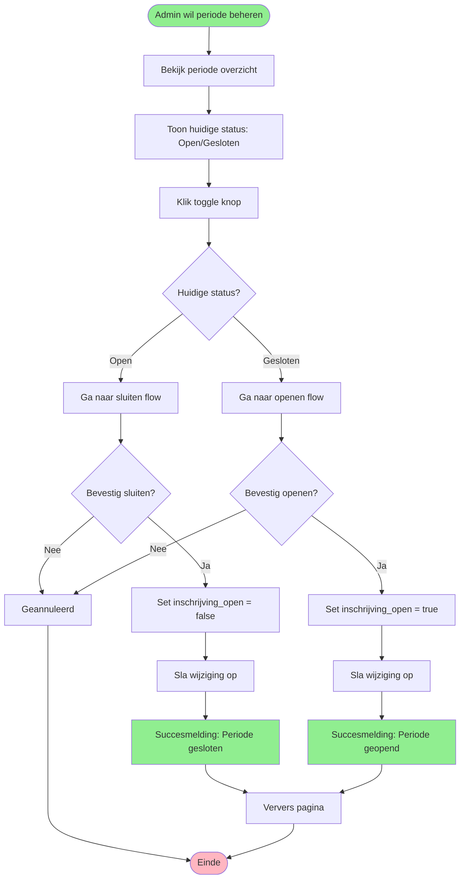

# Activiteitendiagram - Keuzedelen Inschrijf Applicatie

**Project:** Keuzedelen Inschrijf Systeem  
**Datum:** 1 februari 2026  
**Niveau:** MBO4

---

## Wat is een Activiteitendiagram?

Een activiteitendiagram laat zien:
- **Welke stappen** er genomen worden (activiteiten)
- **In welke volgorde** dingen gebeuren (flow)
- **Wanneer** er keuzes gemaakt worden (beslissingen)
- **Wie** wat doet (swimlanes)

Het is als een stappenplan of flowchart van een proces.

---

## Symbolen Uitleg

| Symbool | Naam | Betekenis |
|---------|------|-----------|
| ⚫ | Start | Hier begint het proces |
| ⬛ | Einde | Hier stopt het proces |
| ▭ | Activiteit | Een actie die uitgevoerd wordt |
| ◇ | Beslissing | Een keuze (ja/nee) |
| ➡️ | Pijl | Richting van de flow |
| ║ | Swimlane | Wie is verantwoordelijk |

---

## Diagram 1: Student Inschrijft voor Keuzedelen

### Mermaid Syntax


### ASCII Versie
```
           ⚫ START
           │
      [Student wil inschrijven]
           │
           ▼
      ◇ Ingelogd?
      │         │
     Nee        Ja
      │         │
      ▼         │
  [Login met    │
   email/pwd]   │
      │         │
      ▼         │
  ◇ Correct?    │
   │      │     │
  Nee     Ja    │
   │      │     │
   │      └─────┤
   │            ▼
   │        ◇ Role = student?
   │         │              │
   │        Nee            Ja
   │         │              │
   │         ▼              ▼
   │    [Toegang       [Bekijk keuzedelen]
   │     geweigerd]         │
   │         │              ▼
   │         ▼         [Klik Inschrijven]
   │       ⬛ EINDE         │
   │                        ▼
   │                   ◇ Periode open?
   │                    │           │
   │                   Nee         Ja
   │                    │           │
   │                    ▼           ▼
   │              [Foutmelding] [Toon formulier]
   │                    │           │
   │                    ▼           ▼
   │                  ⬛ EINDE  [Selecteer 3 keuzes]
   │                                │
   │                                ▼
   │                          [Klik Bevestigen]
   │                                │
   │                                ▼
   │                          ◇ Validatie OK?
   │                           │          │
   │                          Nee        Ja
   │                           │          │
   │                           │          ▼
   │                           │    ◇ Alle verschillend?
   │                           │     │            │
   │                           │    Nee          Ja
   │                           │     │            │
   │                           │     │            ▼
   │                           │     │      ◇ Al behaald?
   │                           │     │       │         │
   │                           │     │      Ja        Nee
   │                           │     │       │         │
   │                           │     │       │         ▼
   │                           │     │       │    ◇ Actief?
   │                           │     │       │     │     │
   │                           │     │       │    Nee   Ja
   │                           │     │       │     │     │
   │                           │     │       │     │     ▼
   │                           │     │       │     │  ◇ Vol?
   │                           │     │       │     │   │  │
   │                           │     │       │     │  Ja Nee
   │                           │     │       │     │   │  │
   └───────────────────────────┴─────┴───────┴─────┴───┘  │
                                                           ▼
                                                  [Sla inschrijving op]
                                                           │
                                                           ▼
                                                  [Toon succesmelding]
                                                           │
                                                           ▼
                                                         ⬛ EINDE
```

---

## Diagram 2: Admin Upload CSV Bestand

### Mermaid Syntax


### Tekst Stappenplan

**Stap 1: Authenticatie**
1. Admin opent CSV upload pagina
2. Systeem controleert of gebruiker ingelogd is
3. Systeem controleert of gebruiker admin rol heeft
4. Als niet → toegang geweigerd

**Stap 2: Bestand Selecteren**
5. Systeem toont upload formulier
6. Admin selecteert CSV bestand van computer
7. Admin klikt "Upload CSV"

**Stap 3: Validatie**
8. Systeem controleert of bestand geselecteerd is
9. Systeem controleert of bestand .csv extensie heeft
10. Als niet → foutmelding

**Stap 4: CSV Parsen**
11. Systeem leest CSV bestand
12. Systeem detecteert delimiter (';' of ',')
13. Systeem leest header rij (rij 7)
14. Systeem controleert of alle benodigde kolommen aanwezig zijn:
    - Studentnummer
    - Naam
    - Klas
    - Behaalde keuzedelen
15. Als niet → foutmelding met logging

**Stap 5: Data Verwerken**
16. Voor elke rij in CSV (vanaf rij 8):
    - **a.** Extract studentnummer, naam, klas
    - **b.** Controleer of user al bestaat (op basis van studentnummer)
    - **c.** Als bestaat → skip deze rij
    - **d.** Als niet bestaat → maak nieuwe user aan met:
        - Studentnummer
        - Naam
        - Email (gegenereerd)
        - Klas
        - Role = 'student'
        - Password (gegenereerd)
        - csv_source = bestandsnaam
    - **e.** Sla user op in database
    
**Stap 6: Keuzedelen Koppelen**
17. Voor elke behaalde keuzedeel kolom in de rij:
    - **a.** Haal keuzedeelcode op (bijv. "SD-001")
    - **b.** Zoek keuzedeel in database op basis van code
    - **c.** Als niet gevonden → log warning, ga verder
    - **d.** Als gevonden → maak BehaaldeKeuzedeel record:
        - user_id = nieuwe user
        - keuzedeel_id = gevonden keuzedeel
    - **e.** Sla behaald keuzedeel op in database

**Stap 7: Afsluiten**
18. Sla CSV bestand op in `storage/app/csv/`
19. Toon succesmelding met aantal aangemaakte users
20. Toon lijst van alle geüploade bestanden

---

## Diagram 3: Admin Verwijdert CSV en Users

### Mermaid Syntax


### Tekst Stappenplan

**Stap 1: Selecteren**
1. Admin bekijkt lijst geüploade CSV bestanden
2. Admin klikt op "🗑️ Verwijderen" knop bij een bestand
3. Systeem vraagt bevestiging met waarschuwing

**Stap 2: Bevestiging**
4. Als admin op "Annuleren" klikt → proces stopt
5. Als admin bevestigt → ga verder

**Stap 3: Validatie**
6. Systeem haalt bestandsnaam op
7. Systeem controleert of bestand bestaat in `storage/app/csv/`
8. Als niet → foutmelding

**Stap 4: Users Zoeken**
9. Systeem zoekt alle users waar `csv_source` = bestandsnaam
10. Systeem telt aantal gevonden users

**Stap 5: Users Verwijderen (Cascade)**
11. Voor elke gevonden user:
    - **a.** Verwijder alle behaalde keuzedelen (uit `behaalde_keuzedelen` tabel)
    - **b.** Verwijder alle inschrijvingen (uit `inschrijvingen` tabel)
    - **c.** Verwijder de user zelf (uit `users` tabel)

**Stap 6: Bestand Verwijderen**
12. Verwijder CSV bestand van schijf
13. Controleer of verwijderen gelukt is

**Stap 7: Feedback**
14. Toon succesmelding: "CSV en X users verwijderd"
15. Ververs lijst van bestanden (bestand is nu weg)

---

## Diagram 4: Periode Open/Sluiten (Toekomst)

### Mermaid Syntax


---

## Swimlane Diagram: Student Inschrijving

**Swimlanes tonen wie verantwoordelijk is voor elke actie**

```
┌─────────────────────────────────────────────────────────────┐
│                          STUDENT                            │
├─────────────────────────────────────────────────────────────┤
│  ⚫ Start                                                    │
│   │                                                          │
│   ▼                                                          │
│  [Open keuzedelen pagina]                                   │
│   │                                                          │
│   ▼                                                          │
│  [Klik op Inschrijven]                                      │
│   │                                                          │
│   ▼                                                          │
│  [Selecteer 1e keuze]                                       │
│   │                                                          │
│   ▼                                                          │
│  [Selecteer 2e keuze]                                       │
│   │                                                          │
│   ▼                                                          │
│  [Selecteer 3e keuze]                                       │
│   │                                                          │
│   ▼                                                          │
│  [Klik Bevestigen] ─────────────────────────────┐           │
│                                                  │           │
└──────────────────────────────────────────────────┼───────────┘
┌──────────────────────────────────────────────────┼───────────┐
│                         SYSTEEM                  │           │
├──────────────────────────────────────────────────┼───────────┤
│                                                  ▼           │
│                                           [Controleer of     │
│                                            student ingelogd] │
│                                                  │           │
│                                                  ▼           │
│                                           ◇ Periode open?    │
│                                            │           │     │
│                                           Nee         Ja     │
│                                            │           │     │
│                                            ▼           ▼     │
│                                         [Fout]  [Valideer    │
│                                            │     3 keuzes]   │
│                                            │           │     │
│                                            │           ▼     │
│                                            │    ◇ Verschillend?│
│                                            │     │         │ │
│                                            │    Nee       Ja │
│                                            │     │         │ │
│                                            │     ▼         ▼ │
│                                            │  [Fout] [Check  │
│                                            │     │    behaald]│
│                                            │     │         │ │
│                                            │     │         ▼ │
│                                            │     │   ◇ Al behaald?│
│                                            │     │    │      │ │
│                                            │     │   Ja     Nee│
│                                            │     │    │      │ │
│                                            │     ▼    ▼      ▼ │
│                                            └─►[Toon  [Sla op  │
│                                                fout]  in DB]  │
│                                                 │       │     │
│                                                 │       ▼     │
│                                                 │ [Success-   │
│                                                 │  melding]   │
│                                                 │       │     │
└─────────────────────────────────────────────────┼───────┼─────┘
┌─────────────────────────────────────────────────┼───────┼─────┐
│                         STUDENT                 │       │     │
├─────────────────────────────────────────────────┼───────┼─────┤
│                                      ◄──────────┴───────┘     │
│                                      │                         │
│                                      ▼                         │
│                               [Zie resultaat]                  │
│                                      │                         │
│                                      ▼                         │
│                                    ⬛ Einde                    │
└─────────────────────────────────────────────────────────────── ┘
```

---

## Beslissingstabel: Inschrijving Validatie

| # | Periode Open | Keuzedeel Actief | Vol | Al Behaald | Verschillend | Resultaat |
|---|--------------|------------------|-----|------------|--------------|-----------|
| 1 | ❌ Nee | - | - | - | - | ❌ Fout: Periode gesloten |
| 2 | ✅ Ja | ❌ Nee | - | - | - | ❌ Fout: Keuzedeel inactief |
| 3 | ✅ Ja | ✅ Ja | ❌ Ja | - | - | ❌ Fout: Keuzedeel vol |
| 4 | ✅ Ja | ✅ Ja | ✅ Nee | ❌ Ja | - | ❌ Fout: Al behaald |
| 5 | ✅ Ja | ✅ Ja | ✅ Nee | ✅ Nee | ❌ Nee | ❌ Fout: Niet verschillend |
| 6 | ✅ Ja | ✅ Ja | ✅ Nee | ✅ Nee | ✅ Ja | ✅ **Inschrijving OK** |

**Legenda:**
- ✅ = Ja / Voldoet
- ❌ = Nee / Voldoet niet
- - = Niet relevant voor deze check

---

## Tips voor MBO4

### Hoe lees je een activiteitendiagram?

1. **Start bij de groene cirkel** (⚫ Start)
2. **Volg de pijlen** van boven naar beneden
3. **Let op ruiten** (◇) = hier wordt een keuze gemaakt
4. **Rechthoeken** = acties die uitgevoerd worden
5. **Eindigt bij rode vierkant** (⬛ Einde)

### Waarom is dit belangrijk?

- **Duidelijk proces:** Je ziet precies wat er gebeurt
- **Fouten vinden:** Als iets niet klopt, zie je waar in het proces
- **Testen:** Je kunt elk pad langs om bugs te vinden
- **Documentatie:** Anderen begrijpen hoe het werkt

### Hoe gebruik je dit bij programmeren?

1. **Neem het diagram**
2. **Elke rechthoek = functie of code**
3. **Elke ruit = if-statement**
4. **Volg de flow in je code**

**Voorbeeld in code:**
```php
// Diagram stap: ◇ Periode open?
if (!$periode->inschrijving_open) {
    // Nee-pad: [Fout: Periode gesloten]
    return back()->with('error', 'Inschrijfperiode is gesloten');
}

// Ja-pad: ga verder met volgende check
```

---

## Implementatie Status

| Diagram | Status | Opmerkingen |
|---------|--------|-------------|
| Student Inschrijving | 🟡 Basis | Basis werkt, validatie checks ontbreken |
| CSV Upload | ✅ Compleet | Volledig geïmplementeerd |
| CSV Verwijderen | ✅ Compleet | Met cascade delete |
| Periode Open/Sluiten | ❌ TODO | Nog niet gebouwd |

---

## Toekomstige Processen

### 5. Admin Wijst Keuzedelen Toe
- Input: Lijst inschrijvingen per keuzedeel
- Proces: Admin bekijkt prioriteiten en wijst toe
- Output: Elke student krijgt 1 toegewezen keuzedeel

### 6. Email Notificatie
- Trigger: Student schrijft in
- Proces: Systeem stuurt bevestigingsmail
- Output: Email in inbox van student

### 7. SLB Bekijkt Student Voortgang
- Input: Selecteer student
- Proces: Systeem toont behaalde + ingeschreven keuzedelen
- Output: Overzicht voor begeleiding

